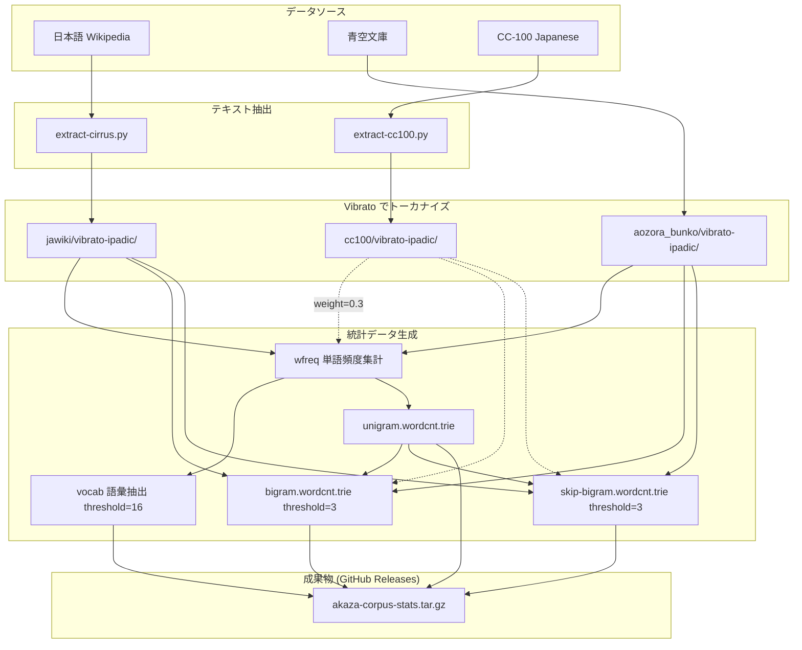
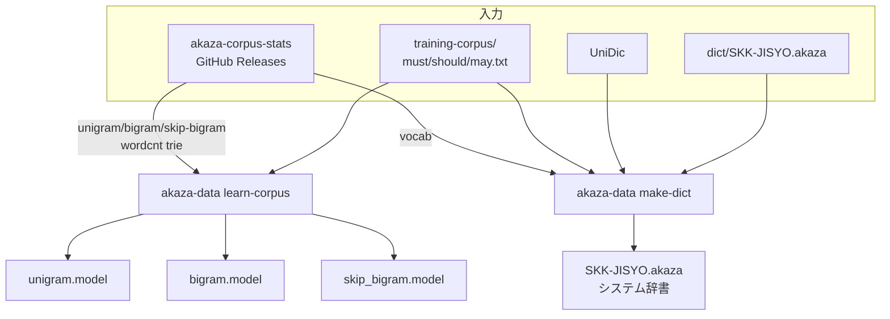

# データフロー

Akaza の言語モデルとシステム辞書は、2つのリポジトリに分かれたパイプラインで構築される。

| リポジトリ | 役割 |
|---|---|
| [akaza-corpus-stats](https://github.com/akaza-im/akaza-corpus-stats) | コーパスの収集・トーカナイズ・統計データ生成 |
| [akaza-default-model](https://github.com/akaza-im/akaza-default-model) | 統計データからモデルと辞書を構築 |

## 1. コーパス統計の生成 (akaza-corpus-stats)

オープンなコーパスからトーカナイズ済みの n-gram 統計データを生成する。
わかちがき処理及びよみがな処理には [Vibrato](https://github.com/daac-tools/vibrato) (ipadic) を利用している。

### データソース

| ソース | 内容 |
|---|---|
| 日本語 Wikipedia | CirrusSearch ダンプ (NDJSON) |
| 青空文庫 | git submodule で取り込み |
| CC-100 Japanese | Common Crawl ベースの大規模テキスト (品質フィルタ適用) |

CC-100 は `-full` バリアントで使用され、重み付き（デフォルト 0.3）で統計に組み込まれる。

#### CC-100 の重み 0.3 の根拠

Wikipedia は百科事典的な語彙に偏り、日常語（買う・結構・寝る・使う等）の頻度が低い。CC-100 はこれを補うために導入されたが、CC-100 は jawiki の約 1.9 倍のボリュームがあり、そのまま統合すると機能語の崩壊（`と→途`、`さい→賽` 等）が発生し再現率が 1.28% 低下する。

weight=0.3 を適用すると実効的な寄与は `1.9 × 0.3 ≒ 0.57 倍`となり、jawiki の統計を基盤としつつ CC-100 で日常語を補強する構成が実現できる。この設定で Good +316、再現率 +0.59% の改善が確認された。

詳細な評価は [akaza-default-model/docs/cc100-weighted-integration.md](https://github.com/akaza-im/akaza-default-model/blob/main/docs/cc100-weighted-integration.md) を参照。

### パイプライン

※ 破線は `-full` バリアントのみで使用される CC-100 のフローを示す。

## 2. モデル構築 (akaza-default-model)

akaza-corpus-stats の成果物をダウンロードし、コーパス補正を加えてモデルと辞書を構築する。

### コーパス補正

Wikipedia・青空文庫のデータには偏りがあるため、手作業で作成したコーパスでスコアを補正する。

| ファイル | エポック数 | 用途 |
|----------|-----------|------|
| `must.txt` | 10,000 | 必ず変換できなくてはならない表現 |
| `should.txt` | 100 | 変換できてほしい表現 |
| `may.txt` | 10 | できれば変換できてほしい表現 |

### パイプライン

### 成果物

| ファイル | 内容 |
|---|---|
| `unigram.model` | 単語出現コスト (MARISA Trie) |
| `bigram.model` | 単語間遷移コスト (MARISA Trie) |
| `skip_bigram.model` | 1語スキップ遷移コスト (MARISA Trie) |
| `SKK-JISYO.akaza` | システム辞書 (SKK-JISYO.L に含まれない語彙) |

## 3. ユーザー言語モデル

Akaza はユーザーごとに学習が可能なように設計されている。
シンプルに実装するために、ユーザー言語モデルはプレインテキスト形式で保存される。
プレインテキスト形式なので、ユーザーは自分の好きなようにファイルを変更することが可能である。
